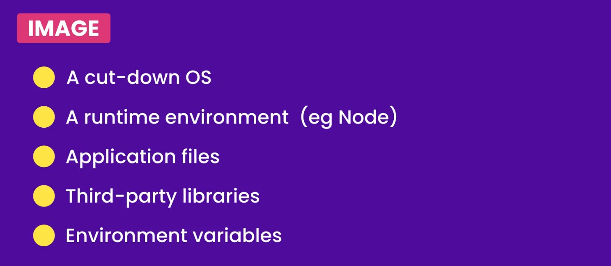

# The ultimate docker course

A `Dockerfile` is a text document that contains all the commands a user could call on the command line to assemble an image.


A `Docker image` is a read-only template that contains a set of instructions for creating a **container** for example:



Once we have an image, we tell docker to start a container using that image.

---

### Dockerize a Node app

1) Create `Dockerfile`

```dockerfile
FROM node:alpine # base image
# (.) copy all files from current directory
# (/app) into /app directory inside the image
COPY . /app
# command to launch our app
CMD node /app/app.js

# OR

WORKDIR /app
CMD node app.js
```

2. Build the image (Put image into container): `docker build -t tag_name .`
   
   1. `.` : means that `Dockerfile` exist in current directory.

3. Display all docker images: `docker images ls`

4. Run the image: `docker run tag_name`


> To download an image: `docker pull image_name`


